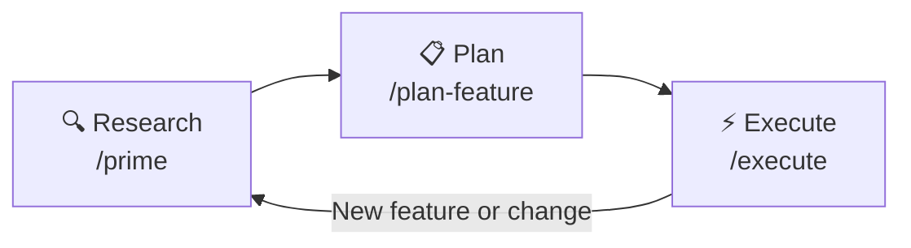

# research-plan-implement-loop

To get more predictable and reliable results from AI, we need to be intentional about how we use it. The biggest gains come from following a clear process instead of jumping straight into code generation.

Here's the recommended flow:

## 1️⃣ Start with research (/prime)

Always begin by researching the codebase.
Use the prime command to load relevant context into the agent — this can be:

- A full end-to-end feature
- A specific domain area
- A workflow across services
- Any meaningful slice of the system

This ensures the agent understands how things actually work before making suggestions. The better the context, the better the output.

## 2️⃣ Create a plan (/plan-feature)

Once the context is loaded, plan the work before executing anything.
This helps:

- Break the feature into logical steps
- Identify dependencies
- Surface architectural considerations
- Align with existing patterns

A solid plan dramatically reduces rework and surprises.

## 3️⃣ Execute deliberately (/execute)

After validating the plan, use /execute to implement it step by step.
Because the context and plan are already established, execution becomes far more accurate and consistent.

These are executable slash commands and will soon be available in the Mono repo.

## Recent Changes

- **plan-feature**: Added `name` field to frontmatter and improved description for better discoverability. Integrated **Context7 MCP** for fetching up-to-date library/framework documentation during planning. Streamlined the plan template by removing redundant checklist sections (Pattern Consistency, Information Density, Success Metrics, Report) to keep focus on actionable output.

---

If we follow this sequence — **Research → Plan → Execute** — we'll get outputs that are more structured, aligned with our architecture, and far less prone to random or inconsistent results.
